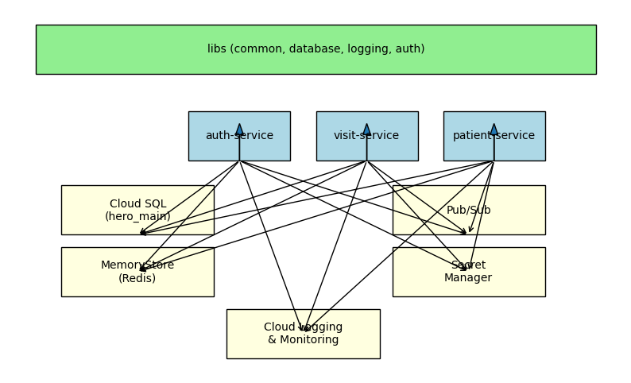
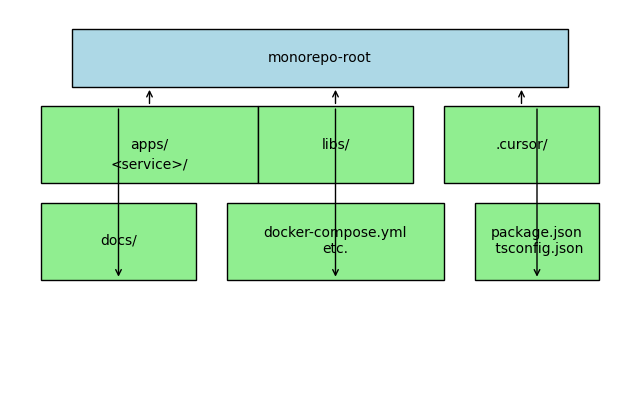

# Arquitectura y Diagramas del Proyecto

Esta sección describe la arquitectura general del proyecto Hero Med, así como la infraestructura de despliegue. Incluye diagramas que ilustran la relación entre los microservicios, las librerías compartidas y los servicios de Google Cloud.

## Arquitectura de Microservicios en el Monorepo

El repositorio alberga múltiples microservicios (`apps/`) que comparten código común (`libs/`). Cada microservicio se despliega en un contenedor independiente pero se gestionan juntos en el monorepo. La base de datos es PostgreSQL (Cloud SQL) y, en el futuro, cada tenant podrá tener su propia base de datos. Se utilizan servicios de soporte como Pub/Sub y Redis para mensajería y cache.

### Descripción del diagrama

- **Microservicios**: `auth-service`, `visit-service`, `patient-service` (ejemplos) se ejecutan en contenedores de Cloud Run y tienen su propia API REST.
- **Librerías compartidas** (`libs/`): se consumen en cada microservicio e incluyen utilidades de logging, autenticación y bases de datos.
- **Cloud SQL**: instancia única (`hero_main`) que aloja las tablas con un campo `tenant_id`. Todos los servicios se conectan a esta base de datos.
- **Cloud Logging & Monitoring**: reciben logs estructurados con campos `tenantId` y `correlationId` para trazabilidad.
- **Pub/Sub** (opcional): permite comunicación asíncrona entre servicios (por ejemplo, emisión de eventos).
- **MemoryStore (Redis)**: se puede usar para caché o colas ligeras.
- **Secret Manager**: almacena secretos (contraseñas, claves JWT) y los expone a los servicios de manera segura.
- **Cloud Run**: gestiona el despliegue de cada microservicio con escalado automático.

## Estructura del Monorepo

El siguiente diagrama muestra la estructura de carpetas del monorepo y la relación entre ellas.

### Explicación

- **apps/**: contiene un directorio por microservicio con su código y configuración.
- **libs/**: contiene módulos reutilizables.
- **docs/**: documentación general del proyecto.
- **.cursor/**: prompts y reglas para IA/Cursor.
- **docker-compose.yml**: orquesta la ejecución local.

Estos diagramas facilitan la comprensión visual del sistema y deben mantenerse actualizados a medida que evolucionan los servicios y la infraestructura.

